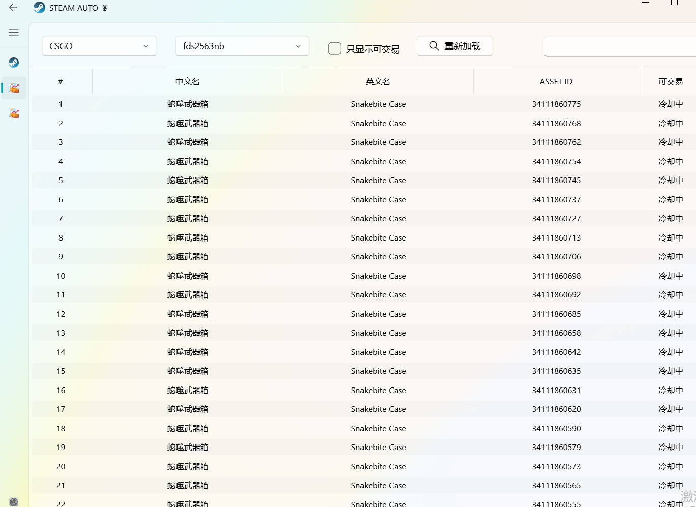

    steam库存自动发货工具
    预计支持平台：BUFF - UU

强类型写管了，目前代码很乱，勿喷

# 问题
- 问：会导致buff或steam封号吗？
  - 答：未知！目前使用的steam接口部分都是sda或steamKit项目公开的接口。buff接口部分都是网页接口！

- 问：关于提示mafile文件需要重新导入的问题
    - 答：steam更新了登录接口，而我目前搞不定，所以需要使用最新版本的sda导入后，拿到新的mafile文件才能刷新token。
      新的mafile文件中会包含两个token（refresh_token与access_token）
      access_token有效期为1天，refresh_token（可刷新access_token）一年

- 问：代理问题
  - 答： 开发者使用的v2ray所以目前设置的使用代理就是他，别的代理自己改端口。也没有测试过别的代理。且开启v2ray全局代理会无法访问buff，只能使用非全局代理（原因未知） 。
# steamAuto-UI

- [x] 自动确认BUFF报价（需要导入buff cookie）
- [ ] buff主动发起报价
- [ ] 自动确认UU报价（需要导入UU cookie）
- [ ] UU主动发起报价

## UI展示

**steam导入界面**

- 右键当前行可选择到 buff或UU平台的cookie

**库存展示**

**出售历史**

